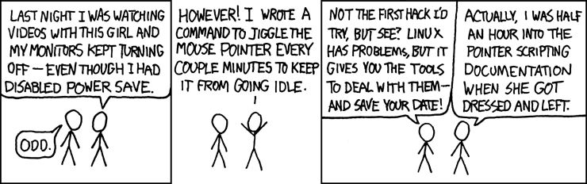

# An introduction

The idea of the course is to teach you how to work around in the command line environment, and how to use the tools it offers to make working, with files for example, easier and faster. The course syllabus is divided into seven weeks, each of which introduces a new topic, and the course ends in a final project.

A table of the contents of the course:

|Week      |Topic      |
|----------|---------
|`1` | [Introduction to Command Line Environments](#week-1)
|`2` | [Navigating a UNIX system](#week-2)
|`3` | [Basic Corpus Processing](#week-3)
|`4` | [Advanced Corpus Processing](#week-4)
|`5` | [Scripting and Configuration Files](#week-5)
|`6` | [Installing and Running Programs](#week-6)
|`7` | [Version Control](#week-7)
|`Final Assignment` |[Building Webpages using GitHub Pages](#final-assignment)

## Week 1

**Introduction to Command Line Environments**

The first week teaches you how to set up a command line environment, as well as some basic commands. You also learn about directories and textfiles, and how to move them between directories and how to edit them.

*During the week I learned...* what an operating system is, and about the history and difference between Linux and Unix. On the more practical side I learned how to fetch content from the internet with the command **wget**, and how to view a text file with the commands **cat** and **less**. I also learned how to create and change directories and how to use the **emacs** text editor.

**Some of the commands I learned:**
* wget 
* cd
* ls
* mv
* less
* cp
* mkdir
* rm

**Example code from the week:**
```
echo Hello, World > hello.txt
```
This writes the text "Hello, World" into a file called hello.txt.

## Week 2

**Navigating a UNIX System**

On the second week, you learn more about the UNIX file system. You learn how to copy and delete, as well as move and rename directories. You also learn about processes and the standard system directories, and how the privacy of users is being protected by different permissions.

*During the week I learned...* how to remove and copy directories even when they are not empty, how to start and kill sleep processes, about the way the unix file system is organized and about the special directories such as the root directory. I also learned to use the **ssh** command to connect the puhti remote server and to change the access permisions of files with the **chmod** command.

**Some of the commands I learned:**
* cp -R
* rmdir
* which
* kill
* chmod
* sort
* ssh

**Example code from the week:**
```
chmod a+r
```
This command gives all users permissions to read a file without changing the write or execute permissions.

## Week 3

**Basic Corpus Processing**

This week is about character encodings, regular expressions and formatted text files. Character encodings are different ways to represent text in a binary format, and regular expressions are strings of text that can be used to search for some particular pattern. Text files can be called formatted text files when their contents are organized in columns separated by some special character.

*During the week I learned...* to generate an alphabetized word list from a text file and use the **egrep** command with regular expressions to search for patterns in a text. I also learned about different character encodings, like ASCII and UTF-8, and to cut and paste columns from and into formatted text files. 


**Some of the commands I learned:**
* tr - transforms characters into other characters
* egrep - echos strings that match the pattern given to it as a parameter
* wc - counts lines, words and characters
* uniq - removes duplicates
* iconv - converts character encodings
* dos2unix - transforms the end of lines in a text file from a windows format to a unix format

**Example code from the week:**
```
cat book.txt  2> errors.txt| tr '\n' ' ' > output.txt
```
This transforms the book.txt file into one long line and directs it to the output.txt file. Any error messages are printed to the errors.txt file.

## Week 4

**Advanced Corpus Processing**

Week 4 introduces pipelines, which can be used to redirect output from one program as input into another. This allows for more complex text processing without needing to perform each command separately. This week you also learn about the **sed** command, which can be used to edit files without opening them. With **sed** you can, for example, substitute every occurance of some pattern into another and you can use extended regular expressions with the **-E** flag to search for the patterns.

*During the week I learned...* to generate a frequency list, as well as sentence per line format from a text file, and I also learned to turn a text file into a list of word n-grams.

**An example pipeline of commands from the week:**
```
cat file.txt | tr -s '\n\t\r ' '\n' | tr -dc "A-Za-z0-9'\n" | sort | uniq -c | sort -nr
```

This generates a frequency list from the file given as an argument to the **cat** command.  

## Week 5

**Scripting and Configuration Files**

The theme for this week is scripts, which are essentially small programs consisting of UNIX commands. The week also introduces environmental variables, which are used to define the system's properties. Additionally, you also learn about configuration files, which can be used to make environmental variables permanent, as the commands stored in these files are applied every time a new bash program is started.

*During the week I learned...* to write some simple scripts that include if statements and to check and change the value of environment level variables. I also learned to make permanent settings to modify my working environment by editing the .bash_profile file.

**Some example code from the week:**
```
#! /bin/bash

directory=$1

list=$(ls $directory)

for name in $list
do
  echo $name
done
```
This is a script that takes a name of a directory as input, and then loops through all of its contents while printing the name of each file and directory it contains in a list.

## Week 6

**Installing and Running Programs**

This week focuses on installing programs. Programs often come with libraries, which are these collections of prewritten software that the program can use. Installing programs often also requires the installation of dependencies, which are software, usually libraries. These dependencies can be installed by package managers. 

This week you also learn about **make**, which is basically a command for building projects. With **make** you can automate a lot of otherwise repetitive processes by defining a set of tasks to be executed in a Makefile.

*During the week I learned...* the difference between a normal and a root user, to install software with the brew package manager and to use **pip** for python installations. I also learned how to write and run a Makefile.

**Some example code from the week:**
```
%.no_md.txt: %.txt
        python3 src/remove_gutenberg_metadata.py $< $@
```
This is **a make** rule, which removes the metadata of a file. The target of the rule is %.no_md.txt and the dependency %.txt.


## Week 7

**Version Control**

On week 7 you learn about version control. Version control allows you to keep multiple versions of projects and switch between them. The most common version control system is **Git** and the most well-known platform providing Git support is **Github**. 

*During the week I learned...* to install and use git. I learned to create a remote repository in Github and clone it to my local computer. I also learned to add and undo changes in my local repository, and commit and push thm to Github, as well as to create and merge branches into a master branch.

**Some example commands:**
```
git init
```
This initializes a repository from existing code.

```
git status
```
This shows the changes that have and haven't been stages, and which files aren't being tracked by Git.

```
git commit -m 
```
This command adds files to be tracked to the repository. The -m flag allows you to add a message to describe the commit. 

## Final Assignment

**Building Webpages using GitHub Pages**

The last week of the course consists of a final assignment to build a website and to publish it on Github pages. To check that everything is working as it should while developing the website you can use a tool called Jekyll. Jekyll has also themes you can use to customize the website.

*During the week I learned...* install and use Jekyll, to build a website using Github pages and to use markdown for formatting text.

**Some commands from the week:**
```
bundle exec jekyll serve
```
This command runs jekyll to build a local site.



