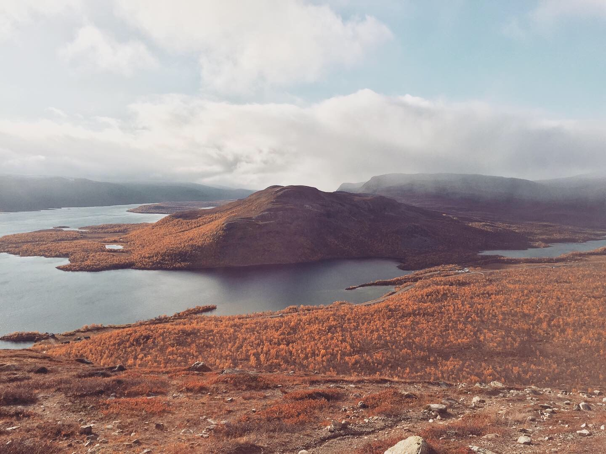

## Introduction

 Hello! I am a third-year student at the University of Helsinki, majoring in linguistics with an interest in language technology. My other interests include computer science, which I am taking as a minor study. On my free time I enjoy dancing, mainly different street styles, learning new languages and travelling. I'm also a big nature lover, and can't spend too much time in the city at once without needing a long break to go hike through forests and climb mountains far away from everything else.

## Find me on

[GitHub](https://github.com/sakorh/sakorh.github.io)

## Contact

My email address is salla.x.korhonen@helsinki.fi. 

## Courses I've Taken

[Ohjelmoinnin perusteet](https://courses.helsinki.fi/fi/tkt10002), spring 2019

[Ohjelmoinnin jatkokurssi](https://courses.helsinki.fi/fi/tkt10003), spring 2019

[Introduction to Language Technology](https://courses.helsinki.fi/en/kik-405/124787882), fall 2019

[Fonetiikka ja fonologia](https://courses.helsinki.fi/fi/kik-lg101), fall 2019

[Morfologia ja syntaksi](https://courses.helsinki.fi/fi/kik-lg102), spring 2020

[Semantiikka ja pragmatiikka](https://courses.helsinki.fi/fi/kik-lg103), spring 2020

[Programming for Linguists](https://courses.helsinki.fi/fi/kik-lg208/120338152), spring 2020

[Command line tools for linguists](https://courses.helsinki.fi/fi/kik-lg219/129824412), fall 2020

## Projects

[cmdline-course](https://github.com/sakorh/cmdline-course)

A project done during the Command line tools for linguists course, which can be used to transform books into different formats such as word frequency lists or into a sentence per line format. 

## Misc. 

[For those in need of some positive energy](https://www.youtube.com/watch?v=gdZLi9oWNZg) 
